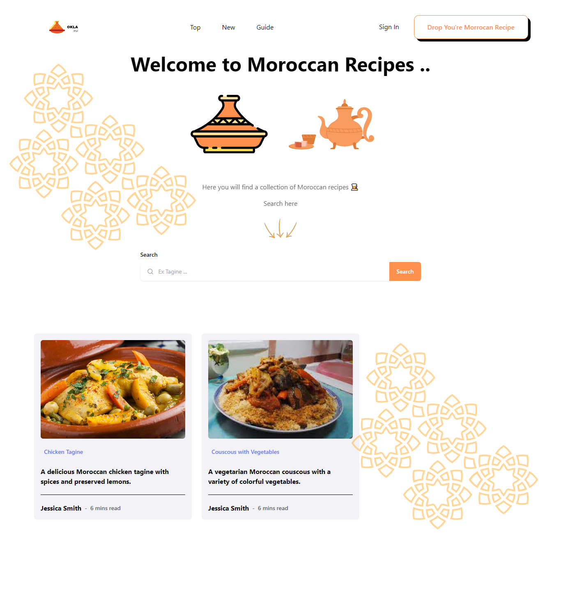

# Moroccan Recipes

This project is a web application built with Vue.js. It's a platform for sharing and discovering Moroccan recipes.

## Project setup

First, clone the repository to your local machine:

```bash
git clone <repository_url>
```

Then, navigate into the project directory:

```bash
cd <project_name>
```

Install the necessary dependencies:

```bash
npm install
```

## Running the application

To start the application in development mode, run:

```bash
npm run serve
```

The application will be available at `http://localhost:8080`.

## Contributing

We welcome contributions! Please see our [Contributing Guidelines](CONTRIBUTING.md) for more details.

## License

This project is licensed under the MIT License - see the [LICENSE](LICENSE) file for details.